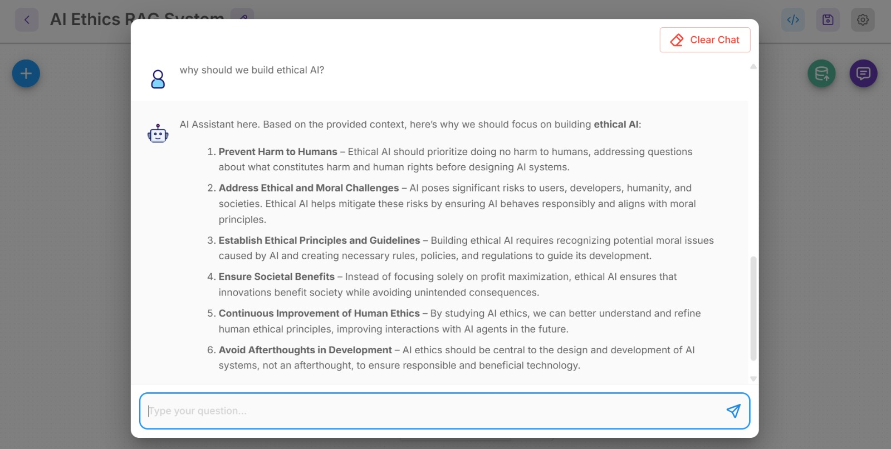

# 🤖 AI Ethics RAG System using n8n

## 📌 Project Overview
This project demonstrates an **AI Ethics RAG (Retrieval-Augmented Generation) System** built using **n8n workflow automation**.  
It uses AI to answer questions based on an AI Ethics document.

---

## 🚀 Features
- 📄 Document-based AI responses
- 🔍 Retrieval-Augmented Generation (RAG)
- 🤖 Automated workflow using n8n
- 💬 Chat-based interaction
- 📊 Visual workflow system

---

## 🛠️ Tools Used
- n8n (Workflow Automation)
- AI Models
- RAG Architecture
- GitHub

---

## 📂 Project Files

- `AI Ethics RAG System Chatflow (1).json.txt` → n8n workflow
- `chatflow.jpeg` → Chat interface output
- `rag system.jpeg` → Workflow diagram

---

## 🖼️ Project Screenshots

### 🔹 Workflow Diagram

### 🔹 Chat Output

---

## ⚙️ How to Run

1. Open n8n
2. Import the JSON file:
   - `AI Ethics RAG System Chatflow (1).json.txt`
3. Configure API keys (if required)
4. Run the workflow
5. Test using chat

---

## 🎯 Use Cases
- AI Ethics learning system
- Document-based chatbot
- Educational assistant
- Research tool

---

## 👩‍💻 Author
Chahat Verma 

---

## ⭐ Support
If you like this project, give it a ⭐ on GitHub!
